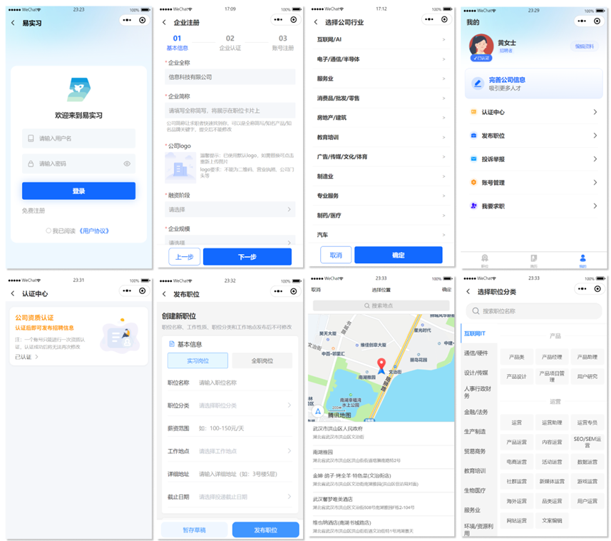

# 实习生招聘系统
> 实习生招聘小程序，包含三端仿Boss直聘和实习僧，毕业设计-课程设计
### 1. 招聘端和应聘端
招聘端和应聘端的前端界面基于uniapp开发，运行在微信小程序上
> 招聘端功能

1. 登录注册
2. 公司或个人的资质认证（个人可加入公司）
3. 职位发布（包括修改、删除，集成地图选址）
4. 简历筛选（发送面试邀请等）
5. 投诉举报

> 应聘端功能
1. 登录注册
2. 简历管理（在线简历基本信息的填写，附件简历上传）
3. 首页职位推荐（采用协同过滤，基于职位推荐或基于内容推荐的多级推荐）
4. 职位搜索（多维度筛选职位）
5. 简历投递
6. 投递反馈（实时查看投递处理结果）
7. 投诉举报

### 2. 管理端
管理端基于开源的vue-pure-admin开发

### 3. 各端实现效果图
#### 3.1 招聘端

#### 3.2 应聘端

